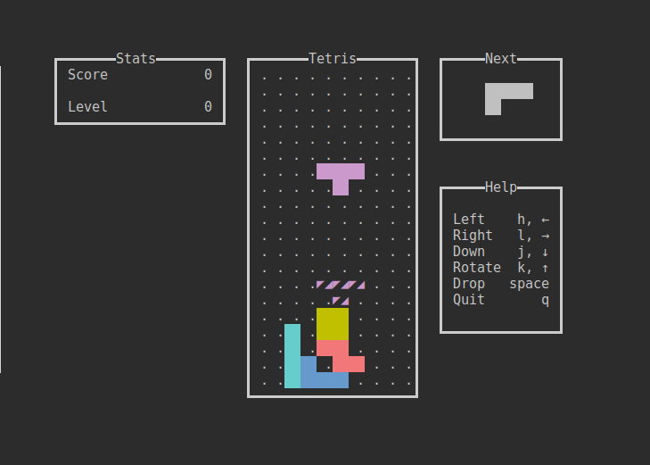
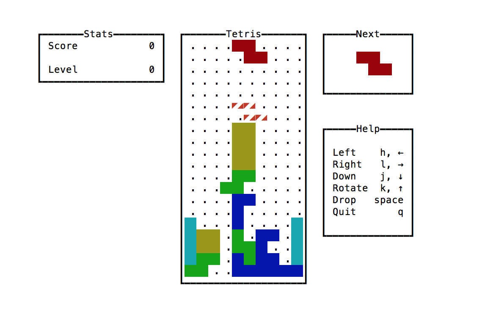
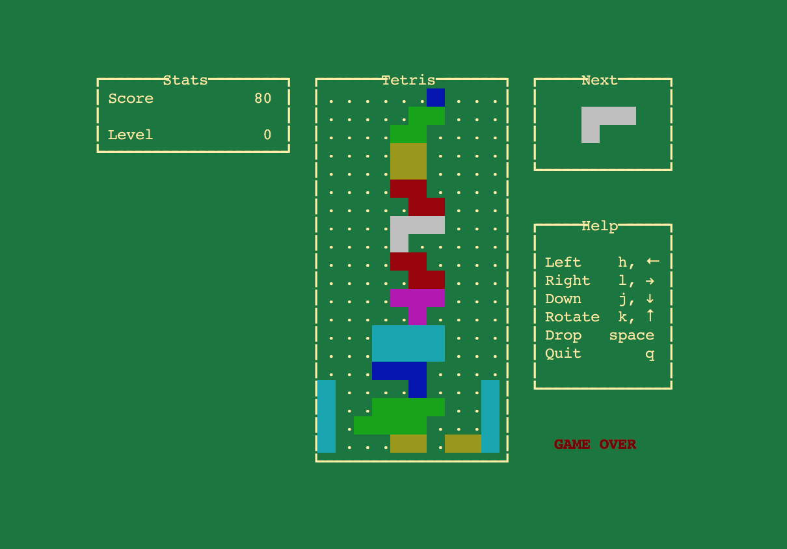

# tetris

A terminal interface for Tetris


## installation

For Mac and Linux, the binaries attached to the GitHub release should suffice.
Here is a quick way to get the one for your OS:
```bash
curl -L https://github.com/samtay/tetris/releases/download/0.1.0/tetris-`uname -s`-`uname-m` | sudo tee /usr/local/bin/tetris
sudo chmod +x /usr/local/bin/tetris
```

For Windows, you have to install from source. First [get stack](https://docs.haskellstack.org/en/stable/README/#how-to-install). Then
```bash
git clone https://github.com/samtay/tetris.git
cd tetris
stack install tetris
```

## screenshots

#### Linux termite - tomorrow night eighties

#### Mac terminal - plain

#### Mac terminal - grass


## todo

1. Leaderboard saved to txt file (requires adding brick viewport for name entry)
and probably wrapping game in a ui state type
2. Use linear V2 instead of tuples.. dummy
3. Consider refactoring (Game -> a) types with State or Reader abstraction
